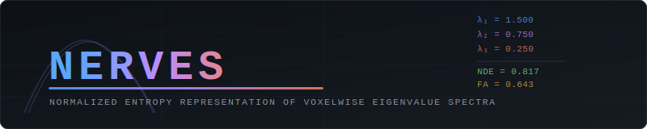

<div align="center">



# NERVES
### Normalized Entropy Representation of Voxelwise Eigenvalue Spectra

[](https://www.python.org/)
[](LICENSE)
[](https://doi.org/)
[](https://fsl.fmrib.ox.ac.uk/)
[](https://www.mrtrix.org/)

**A microstructural diffusion MRI pipeline for computing Normalized Diffusion Entropy (NDE) maps from T1 and DWI data.**

[Installation](#installation) · [Quick Start](#quick-start) · [Documentation](#documentation) · [Citation](#citation)

</div>

---

## Overview

NERVES provides an end-to-end pipeline for computing **Normalized Diffusion Entropy (NDE)** maps from raw diffusion-weighted MRI data. NDE quantifies the Shannon entropy of the diffusion tensor eigenvalue spectrum, providing microstructural sensitivity that is **complementary to — not redundant with — Fractional Anisotropy (FA)**.

### Why NDE?

Two voxels can share identical FA yet differ substantially in NDE whenever the ratio of the minor eigenvalues (λ₂/λ₃) differs. This occurs in clinically important scenarios:

| Scenario | FA response | NDE response |
|---|---|---|
| Early Wallerian degeneration (asymmetric radial diffusivity loss) | Moderate | Sensitive |
| Crossing-fiber voxels vs. single-fiber voxels | May be identical | Distinct |
| Subtle λ₂/λ₃ redistribution at fixed anisotropy | Insensitive | Sensitive |

This sensitivity arises from the logarithmic weighting of the entropy function: the derivative d/dp(−p ln p) diverges as p → 0, making NDE disproportionately responsive to changes in small eigenvalue proportions.

### Mathematical Definition

For eigenvalues λ₁ ≥ λ₂ ≥ λ₃ > 0 at each voxel, define normalised proportions:

$$p_i = \frac{\lambda_i}{\lambda_1 + \lambda_2 + \lambda_3}$$

Shannon entropy of the distribution:

$$H = -\sum_{i=1}^{3} p_i \ln(p_i)$$

Normalised to [0, 1]:

$$\text{NDE} = \frac{H}{\ln(3)}$$

- **NDE = 1** → perfectly isotropic (λ₁ = λ₂ = λ₃)  
- **NDE = 0** → maximally anisotropic (all diffusion along one eigenvector)

---

## Pipeline Overview

```
Raw DWI + T1
     │
     ├── DWI Preprocessing
     │     ├── MP-PCA denoising       (MRtrix3: dwidenoise)
     │     ├── Gibbs ringing removal  (MRtrix3: mrdegibbs)
     │     ├── Brain masking          (FSL: bet)
     │     ├── Susceptibility corr.   (FSL: topup, optional)
     │     └── Eddy/motion correction (FSL: eddy)
     │
     ├── T1 Preprocessing
     │     ├── Brain extraction       (FSL: bet)
     │     ├── Tissue segmentation    (FSL: fast)
     │     └── Registration → DWI    (FSL: flirt or ANTs)
     │
     ├── Tensor Estimation            (FSL: dtifit)
     │
     ├── NDE Computation              (Python/NumPy — native)
     │
     └── QC + Report
           ├── Metric histograms
           ├── Tissue-specific distributions
           ├── NDE vs FA scatter
           ├── Axial slice montage
           └── JSON summary report
```

---

## Installation

### Prerequisites

| Dependency | Version | Purpose |
|---|---|---|
| [FSL](https://fsl.fmrib.ox.ac.uk/fsl/fslwiki/FslInstallation) | ≥ 6.0 | Preprocessing, tensor estimation |
| [MRtrix3](https://www.mrtrix.org/download/) | ≥ 3.0.3 | Denoising, Gibbs removal |
| Python | ≥ 3.8 | NDE computation, QC |
| [ANTs](https://github.com/ANTsX/ANTs) | ≥ 2.3 | Optional: improved T1→DWI registration |

### Python Environment

```bash
# Clone the repository
git clone https://github.com/yourusername/NERVES.git
cd NERVES

# Create and activate a virtual environment (recommended)
python -m venv nerves_env
source nerves_env/bin/activate        # Linux/macOS
# nerves_env\Scripts\activate         # Windows

# Install Python dependencies
pip install -r requirements.txt
```

### Verify Installation

```bash
python nde_pipeline.py --help
```

You should see the full argument list. If FSL or MRtrix3 tools are missing from PATH, an informative error will be raised before any processing begins.

---

## Quick Start

### Full Pipeline (Raw Data)

```bash
python nde_pipeline.py \
    --dwi  sub-01_dwi.nii.gz \
    --bval sub-01_dwi.bval   \
    --bvec sub-01_dwi.bvec   \
    --t1   sub-01_T1w.nii.gz \
    --out  ./sub-01_nerves   \
    --pe_dir AP
```

### With Susceptibility Distortion Correction

```bash
python nde_pipeline.py \
    --dwi    sub-01_dwi.nii.gz \
    --bval   sub-01_dwi.bval   \
    --bvec   sub-01_dwi.bvec   \
    --t1     sub-01_T1w.nii.gz \
    --rpe_b0 sub-01_b0_PA.nii.gz \
    --pe_dir AP \
    --out    ./sub-01_nerves
```

### Skip Preprocessing (Pre-computed Eigenvalues)

If you already have DTI eigenvalue maps (e.g., from FSL `dtifit`):

```bash
python nde_pipeline.py \
    --skip_preproc \
    --l1   dti_L1.nii.gz \
    --l2   dti_L2.nii.gz \
    --l3   dti_L3.nii.gz \
    --mask brain_mask.nii.gz \
    --dwi x --bval x --bvec x --t1 x \
    --out  ./nerves_output
```

### ANTs Registration (Recommended for High-Resolution T1)

```bash
python nde_pipeline.py \
    --dwi  sub-01_dwi.nii.gz \
    --bval sub-01_dwi.bval   \
    --bvec sub-01_dwi.bvec   \
    --t1   sub-01_T1w.nii.gz \
    --out  ./sub-01_nerves   \
    --use_ants
```

---

## Output Structure

```
sub-01_nerves/
├── preproc/
│   ├── dwi_denoised.mif          # MP-PCA denoised DWI
│   ├── dwi_degibbs.mif           # Gibbs-corrected DWI
│   ├── dwi_eddy.nii.gz           # Eddy-corrected DWI
│   ├── mean_b0_final_brain.nii.gz
│   └── mean_b0_final_brain_mask.nii.gz
├── t1/
│   ├── T1_brain.nii.gz
│   ├── T1_fast_pve_0.nii.gz      # CSF partial volume
│   ├── T1_fast_pve_1.nii.gz      # GM partial volume
│   ├── T1_fast_pve_2.nii.gz      # WM partial volume
│   └── T1_pve_*_DWIspace.nii.gz  # PVEs registered to DWI space
├── tensor/
│   ├── dti_L1.nii.gz             # λ₁ (axial diffusivity)
│   ├── dti_L2.nii.gz             # λ₂
│   ├── dti_L3.nii.gz             # λ₃
│   ├── dti_FA.nii.gz             # Fractional anisotropy
│   ├── dti_MD.nii.gz             # Mean diffusivity
│   └── dti_RD.nii.gz             # Radial diffusivity = (λ₂+λ₃)/2
├── nde/
│   ├── nde.nii.gz                # ★ PRIMARY OUTPUT: NDE map
│   └── nde_qc_flag.nii.gz        # Voxels with non-physical eigenvalues
├── qc/
│   ├── qc_histograms.png         # NDE / FA / MD distributions in WM
│   ├── qc_tissue_distributions.png  # NDE by tissue class
│   ├── qc_nde_fa_scatter.png     # NDE vs FA scatter plot
│   └── qc_axial_montage.png      # Axial slice comparison
└── nde_pipeline_report.json      # Full QC statistics and thresholds
```

---

## QC Thresholds

NERVES applies the following automated QC checks and records pass/fail in the JSON report:

| Metric | Expected value | Interpretation if failed |
|---|---|---|
| Non-physical eigenvalue rate | < 5% | Tensor fitting or masking issue |
| CSF mean NDE | ≥ 0.90 | Near-isotropic CSF correctly measured |
| WM mean NDE | < 0.85 | Anisotropic WM correctly differentiated |
| NDE–FA Pearson r (WM) | < −0.80 | Expected strong anticorrelation |

---

## Documentation

- [Installation Guide](docs/installation.md)
- [Pipeline Parameters](docs/parameters.md)
- [NDE Theory](docs/theory.md)
- [QC Interpretation](docs/qc_guide.md)
- [Troubleshooting](docs/troubleshooting.md)
- [Contributing](CONTRIBUTING.md)

---

## Citation

If you use NERVES in your research, please cite:

```bibtex
@article{nerves2025,
  title   = {{NERVES}: Normalized Entropy Representation of Voxelwise
             Eigenvalue Spectra for microstructural diffusion mapping},
  author  = {Author, A. and Author, B.},
  journal = {Journal Name},
  year    = {2025},
  doi     = {10.xxxx/xxxxxx}
}
```

Additionally, please cite the foundational NDE work:

```bibtex
@article{fozouni2013,
  title   = {Characterizing brain structures and remodeling after {TBI}
             based on information content, diffusion entropy},
  author  = {Fozouni, N. and Chopp, M. and Nejad-Davarani, S.P. and
             Zhang, Z.G. and Lehman, N.L. and Gu, S. and others and
             Jiang, Q.},
  journal = {PLoS One},
  volume  = {8},
  number  = {10},
  pages   = {e76343},
  year    = {2013},
  doi     = {10.1371/journal.pone.0076343}
}
```

---

## License

NERVES is released under the [MIT License](LICENSE).

---

## Acknowledgements

NERVES wraps and depends on [FSL](https://fsl.fmrib.ox.ac.uk/) and [MRtrix3](https://www.mrtrix.org/). Please ensure you comply with their respective license terms.
